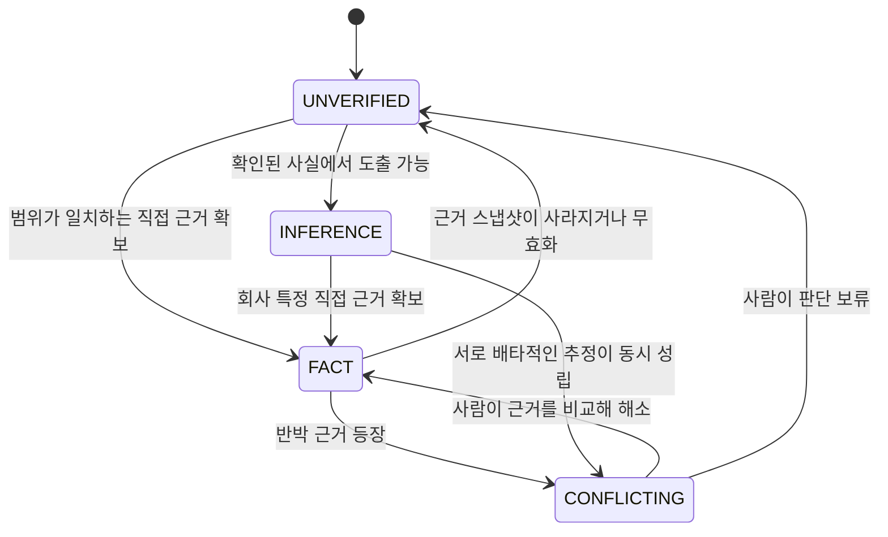
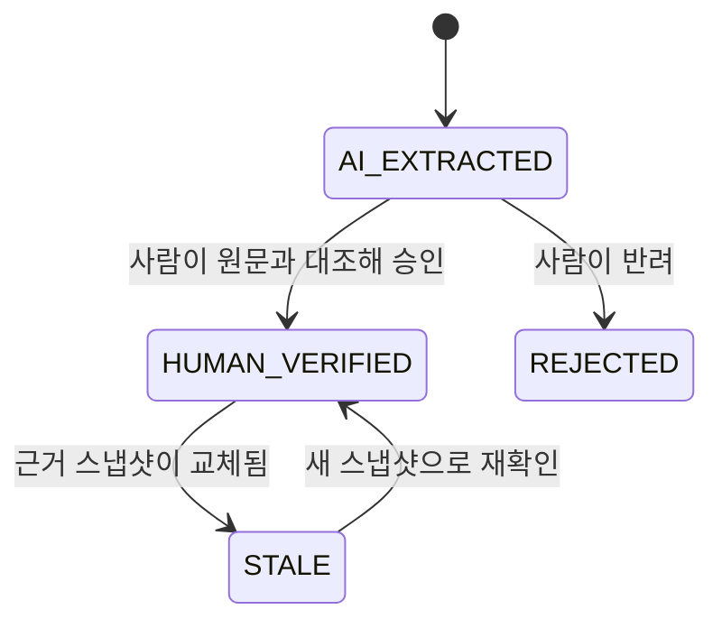

# Claim 상태 전이

주장 상태(assertion status)와 검토 상태(review status)는 서로 다른 축입니다. 하나가 바뀌어도 다른 하나는 자동으로 바뀌지 않습니다.

## 1. 주장 상태 전이

### 전이 규칙

| 전이 | 조건 | 자동/수동 |
|---|---|---|
| → `FACT` | 범위가 일치하는 `SUPPORTS` 근거가 1개 이상 있고, 그 출처가 원문 스냅샷과 해시를 가짐 | **수동**. 시스템은 후보만 제시 |
| → `INFERENCE` | 전제 Claim이 1개 이상이고 추론 설명이 있음. 직접 근거는 없어야 함 | 수동 |
| → `UNVERIFIED` | 근거가 없거나, 있던 근거가 무효화됨 | 근거 소멸 시 자동 |
| → `CONFLICTING` | `REFUTES` 근거가 붙거나, 서로 배타적인 Claim이 동시에 살아 있음 | **자동 표시, 자동 해소 금지** |

핵심: **자동으로 올라가는 전이는 없습니다.** 사실로 올리는 것은 언제나 사람의 행동이고, 내리는 것은 자동일 수 있습니다.

### 금지된 전이

- 확률·유사도·모델 확신도만으로 `INFERENCE` → `FACT`
- 산업 일반 근거만으로 회사 특정 Claim → `FACT`
- `D` 등급 출처만으로 → `FACT`
- 스냅샷·해시가 없는 출처(링크만 있는 출처)만으로 → `FACT`
- 사람 검토 없이 `CONFLICTING` → 다른 상태

## 2. 검토 상태 전이

출처가 갱신되면 기존 Claim을 **삭제하지 않고** `STALE`로 표시합니다.

## 3. 미확인 항목의 처리

`UNVERIFIED`는 빈칸이 아니라 **작업 항목**입니다. 반드시 다음 중 하나 이상으로 전환됩니다.

- 요청자료(`RequestItem`)
- 인터뷰 질문(`InterviewQuestion`)

전환되지 않은 `UNVERIFIED`는 테스트 T11에서 실패합니다.

## 4. 상충의 표현 — 현재 상태와 한계

현재 데이터 모델은 상충을 두 가지 방식으로만 표현할 수 있습니다.

1. **근거 대 근거**: 같은 Claim에 `SUPPORTS`와 `REFUTES` 근거가 함께 붙는 경우
2. **주장 대 주장**: 서로 배타적인 Claim을 `counter_claims`로 연결(현재는 위험 단위에서만 사용)

**알려진 한계**: Claim과 Claim 사이의 상충 관계를 담는 전용 필드가 아직 없습니다. 골든 데이터셋에서는 CL-015(BSP 담보일 가능성)와 CL-017(무관할 가능성)이 서로 배타적인데, 두 Claim 모두 `INFERENCE`로 남겨두고 RK-05의 `counter_claims`로 연결해 두었습니다.

또한 현재 확보한 출처에서는 **진짜 상충 사례가 발견되지 않았습니다.** 상충을 보여주기 위해 억지 사례를 만들지 않았으므로, 골든 데이터셋에 `CONFLICTING` Claim은 0건입니다. 상충 화면은 실제 상충 사례가 생기는 시점(회사 자료가 들어오는 단계)에 검증합니다.

## 5. 규칙과 테스트의 대응

| 규칙 | 검사하는 테스트 |
|---|---|
| FACT는 직접 근거 필수 | T3 |
| 근거 참조 무결성 | T4 |
| 범위를 넘는 승격 금지 | T5, T6 |
| 스냅샷 없는 출처는 FACT 불가 | T7 |
| 스냅샷 재현성(해시) | T8 |
| 인용문이 실제 원문에 존재 | T9 |
| INFERENCE는 전제와 설명 필수 | T10 |
| UNVERIFIED는 확인 행동으로 전환 | T11 |
| 위험 문구의 확정 표현 금지 | T14 |
