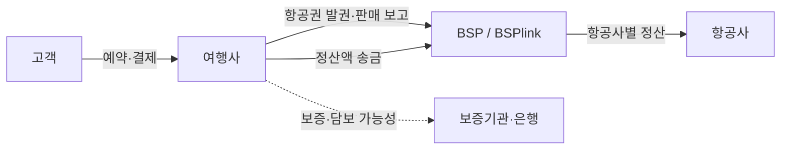
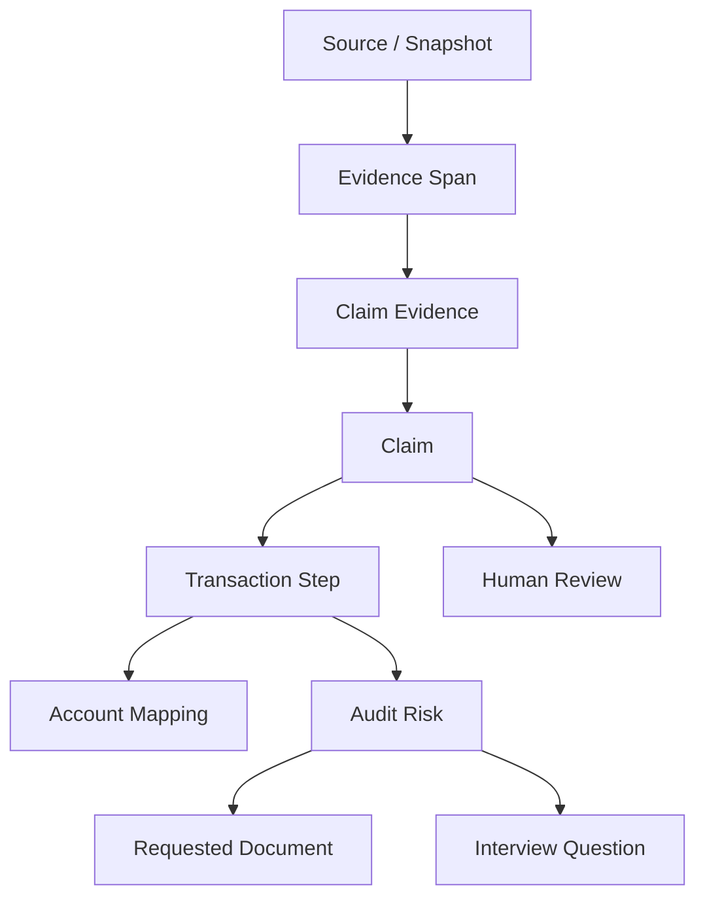
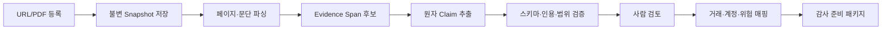

# Audit Context AI — 신규 프로젝트 설계안

작성일: 2026-08-04  
상태: MVP 기획 초안

## 1. 한 줄 정의

> 낯선 회사의 거래 구조를 신뢰 가능한 근거로 빠르게 이해하고, 그 구조를 계정·감사위험·요청자료·인터뷰 질문으로 연결해 주는 감사 준비 도구.

이 제품은 DART 문서를 요약하는 챗봇이 아니다. 핵심 결과물은 답변 문장이 아니라, **근거가 붙은 거래 구조와 감사 연결 지도**다.

## 2. 제품 원칙

1. **거래가 중심이다.** 문서는 입력 수단이고, 핵심 객체는 거래 유형·참여자·재화/서비스 흐름·자금 흐름·정산 흐름이다.
2. **주장이 최소 단위다.** 모든 중요한 문장은 독립적인 `Claim`으로 저장한다.
3. **근거와 해석을 분리한다.** 원문, 원문이 직접 말하는 사실, 그 사실에서 도출한 추정을 별도 필드로 보관한다.
4. **모르면 모른다고 표시한다.** 근거가 없으면 그럴듯하게 완성하지 않고 `미확인`으로 남겨 인터뷰 질문으로 전환한다.
5. **감사 결론을 대신하지 않는다.** 감사인의 이해와 질문 준비를 돕되, 회계처리 적정성이나 감사의견을 자동 확정하지 않는다.
6. **회사 사실과 산업 지식을 섞지 않는다.** “BSP의 일반 구조”와 “이 회사가 BSP를 실제로 이용한다”는 서로 다른 주장이다.
7. **문장마다 출처를 역추적할 수 있어야 한다.** 링크뿐 아니라 문서 버전, 페이지/문단, 원문 발췌, 수집 시점까지 보존한다.

## 3. 기존 프로젝트에 대한 판단

새 저장소로 시작하는 것이 맞다. 기존 DART 프로젝트는 코드베이스가 아니라 **참고 구현과 데이터 공급자 후보**로 취급한다.

### 가져와도 되는 것

- DART 기업 검색·공시 수집 코드 중 독립 모듈로 검증된 부분
- XML/PDF 원문 보존과 문단 위치 추적 경험
- 회사명·법인등록번호·공시 식별자 정규화 규칙
- API 호출 제한, 재시도, 캐시 처리 경험

### 그대로 가져오지 않을 것

- 문서 청크를 바로 임베딩한 뒤 자유 질의하는 중심 구조
- 출처 없는 LLM 요약문을 데이터처럼 저장하는 방식
- “검색 유사도 = 사실 신뢰도”로 간주하는 방식
- DART에 없는 산업 관행을 모델의 사전지식으로 메우는 방식

새 프로젝트가 기존 코드와 결합하면 제품의 핵심 단위가 다시 문서로 끌려갈 가능성이 크다. 따라서 초기에는 복사도 하지 말고, 필요한 기능이 명확해진 뒤 포트 단위로 재구현하거나 어댑터로 연결한다.

## 4. MVP 사용자와 핵심 작업

### 1차 사용자

- 기말감사에 새로 투입된 1~3년 차 감사인
- 회사와 산업을 공부할 시간이 부족한 팀원
- 담당자 인터뷰와 PBC 요청 목록을 준비해야 하는 사람

### 핵심 작업

사용자가 회사/사례를 열면 15분 안에 다음을 파악할 수 있어야 한다.

- 이 거래에 누가 참여하는가?
- 서비스, 문서, 돈은 어떤 순서로 움직이는가?
- 정산 시차와 담보는 왜 생기는가?
- 어느 계정과 공시로 나타날 가능성이 있는가?
- 어떤 왜곡표시 위험이 있는가?
- 어떤 자료를 받고 누구에게 무엇을 물어봐야 하는가?
- 각 설명은 무엇에 근거하며 어디까지가 추정인가?

## 5. MVP 시나리오: 여행업 / BSP / 사용제한예금

### 기준 거래 흐름



IATA의 공식 설명으로 직접 확인할 수 있는 일반 사실은 “BSP가 IATA 공인 여행사와 항공사 사이의 판매 보고·송금·정산을 표준화한다”는 수준이다. 특정 여행사가 어떤 주기로 정산하고 어떤 담보를 제공하는지는 해당 회사의 계약, 은행조회서, 보증서, BSP 명세 등으로 별도 확인해야 한다.

### 데모에서 보여 줄 감사 연결

| 거래 요소 | 잠재 계정/공시 | 잠재 위험 | 요청자료 예시 | 인터뷰 질문 예시 |
|---|---|---|---|---|
| 고객 결제와 발권 | 현금, 선수금/계약부채, 매출 | 인식 시점 오류, 총액·순액 오류 | 예약·발권·결제 상태 매핑표 | 매출은 예약, 발권, 탑승 중 언제 인식합니까? |
| BSP 미정산액 | 미지급금/정산부채 | 기간귀속 및 부채 누락 | 기말 전후 BSP 청구·정산 명세 | 기말 미정산 판매분은 어떤 로직으로 계상합니까? |
| 환불·취소 | 환불부채, 매출차감 | 환불부채 누락, cut-off 오류 | 미처리 환불 목록과 후속 정산 자료 | 취소 접수와 BSP 반영 사이 차이는 어떻게 관리합니까? |
| 담보·질권 | 사용제한예금, 담보제공 공시 | 분류·공시 누락, 권리 제한 미파악 | 예금조회서, 질권계약, 담보 산정 통지 | 담보 요구 주체와 금액 산정 기준은 무엇입니까? |

이 표의 계정과 위험은 처음에는 `추정`이다. 회사의 회계정책, 계정별원장, 계약과 실제 프로세스로 확인된 항목만 `사실`로 승격한다.

## 6. 신뢰 모델

### 6.1 출처 등급

등급은 편의를 위한 요약값이며, 실제 평가는 `권위성`, `직접성`, `최신성`, `회사 특정성`을 따로 보존한다.

| 등급 | 출처 | 허용 용도 |
|---|---|---|
| S | 법령·규정·회계기준 원문, 서명 계약, 은행조회서, 회사 원장·시스템 원본 | 해당 범위의 핵심 사실을 직접 뒷받침. 내부 자료는 해당 회사에만 적용 |
| A | 감독기관·표준제정기관·산업기구 공식 문서, 감사받은 공시 | 제도·산업 일반 사실 또는 공시된 회사 사실 |
| B | 회사 공식 홈페이지·IR·정책 문서, 공식 서비스 제공자 자료 | 회사 주장 또는 서비스 설명. 독립 검증 여부 표시 |
| C | 신뢰도 높은 전문 매체·학술·전문가 자료 | 맥락 보강과 추가 탐색. 핵심 결론은 상위 출처로 교차 확인 권장 |
| D | 블로그·커뮤니티·검색 요약·출처 불명 자료 | 탐색 키워드 생성만 허용. 최종 주장 근거로 단독 사용 금지 |

등급만으로 사실 여부를 결정하면 안 된다. 예를 들어 IATA 문서는 BSP 일반 구조에는 A급이지만, 특정 회사의 담보 금액을 입증하지 못한다. 반대로 회사 내부 계약은 해당 회사에는 직접적이지만 다른 회사로 일반화할 수 없다.

### 6.2 주장 상태

| 표시 | 의미 | 출력 규칙 |
|---|---|---|
| 사실 | 근거 원문이 해당 주장을 직접 지지하고 적용 범위가 일치 | 단정형 허용, 인라인 근거 필수 |
| 추정 | 하나 이상의 사실로부터 논리적으로 도출했으나 직접 확인되지 않음 | “가능성이 있음/확인이 필요함”과 추론 근거 표시 |
| 미확인 | 필요한 근거가 없거나 상충하여 결론을 낼 수 없음 | 빈칸을 숨기지 않고 확인 질문·요청자료로 전환 |
| 상충 | 둘 이상의 근거가 서로 양립하지 않음 | 양쪽 근거를 함께 표시하고 검토 전 결론 금지 |

추가로 검토 상태를 별도 관리한다: `AI 추출 → 사람 검토 완료 → 반려 → 오래됨(stale)`.

### 6.3 주장 단위 근거 규칙

한 Claim은 한 문장으로 표현 가능한 원자적 주장이어야 한다.

```text
나쁜 예: BSP는 항공권을 정산하며 여행사는 담보를 제공하고 이 회사의 예금에는 질권이 있다.

좋은 예:
C1 [사실/산업 일반] BSP는 공인 여행사와 항공사 간 판매 보고·송금·정산을 표준화한다.
C2 [추정/회사 특정] 이 회사의 사용제한예금은 BSP 관련 담보일 가능성이 있다.
C3 [미확인/회사 특정] 해당 예금의 질권자는 IATA 또는 정산은행이다.
```

각 Claim은 아래를 갖는다.

- 주장 문장과 적용 범위: 산업 일반 / 회사 / 기간 / 거래 유형
- 유형: 사실 / 추정 / 미확인 / 상충
- 근거 연결: 지지 / 반박 / 맥락
- 근거 위치: URL 또는 파일, 문서 버전, 페이지, 문단/좌표, 짧은 원문 발췌
- 근거 수집일과 유효일
- 추정일 경우 추론 설명과 전제 Claim 목록
- 생성 모델·프롬프트 버전과 사람 검토 이력

### 6.4 답변 생성 가드레일

1. 최종 문장 생성 전에 검색 결과가 아니라 Claim 집합을 먼저 만든다.
2. 사실 문장은 최소 한 개의 직접 근거가 있어야 한다.
3. D등급 출처만 있는 주장은 사실이 될 수 없다.
4. 산업 일반 근거로 회사 특정 사실을 만들 수 없다.
5. 숫자·날짜·계약조건은 원문과 정확히 일치해야 하며 계산값은 산식과 입력값을 남긴다.
6. 근거가 없으면 미확인 항목과 다음 확인 행동을 출력한다.
7. 인용이 사라지거나 원문 위치를 재현할 수 없으면 배포 검증이 실패한다.

## 7. 정보 구조와 데이터 모델

### 핵심 관계



### 주요 테이블

| 테이블 | 핵심 필드 |
|---|---|
| `workspaces` | id, name |
| `cases` | id, workspace_id, company_name, period_start/end, industry_id, status |
| `industries` | id, code, name |
| `transaction_types` | id, industry_id, name, description |
| `transaction_steps` | id, transaction_type_id, sequence, name, trigger, completion_condition |
| `actors` | id, case_id nullable, actor_type, name |
| `flows` | id, from_actor_id, to_actor_id, step_id, flow_type(service/cash/document), timing |
| `sources` | id, case_id nullable, title, publisher, source_type, url, trust_grade, authority/directness/freshness/company_specificity |
| `source_snapshots` | id, source_id, fetched_at, effective_date, content_hash, storage_key, parser_version |
| `evidence_spans` | id, snapshot_id, page, section, start/end_offset, quote, locator_json |
| `claims` | id, case_id nullable, transaction_type_id nullable, text, scope, assertion_status, review_status, valid_from/to, confidence |
| `claim_evidence` | claim_id, evidence_span_id, relation(supports/refutes/context), notes |
| `claim_dependencies` | claim_id, premise_claim_id, inference_rule |
| `account_mappings` | id, step_id, account_name, direction, rationale_claim_id, status |
| `audit_risks` | id, step_id, assertion, risk_text, rationale_claim_id, status |
| `request_items` | id, risk_id, item, purpose, period, owner_role, priority |
| `interview_questions` | id, risk_id nullable, question, expected_evidence, follow_up_rule |
| `reviews` | id, entity_type/id, reviewer_id, decision, comment, created_at |
| `generation_runs` | id, task_type, model, prompt_version, input_refs, output_refs, started/finished_at, error |

`confidence`는 사실/추정 상태를 대신하지 않는다. 높은 확률의 추정도 여전히 추정이다.

### 최소 API

```text
POST   /api/cases
GET    /api/cases/:caseId
POST   /api/cases/:caseId/sources
POST   /api/sources/:sourceId/process
GET    /api/cases/:caseId/claims
PATCH  /api/claims/:claimId/review
GET    /api/cases/:caseId/transactions
POST   /api/cases/:caseId/transactions/generate
GET    /api/cases/:caseId/audit-pack
POST   /api/cases/:caseId/ask
```

`/ask`는 자유 생성 엔드포인트가 아니다. 검색된 근거 → Claim 후보 → 상태 판정 → 인용 검증 → 문장 조립의 순서를 강제한다.

## 8. 기술 스택

### MVP 권장안: 모듈식 모놀리스 + 비동기 문서 작업자

| 영역 | 선택 | 이유 |
|---|---|---|
| 웹/UI/API | Next.js App Router + TypeScript | 한 저장소에서 화면과 얇은 API를 빠르게 개발 |
| UI | Tailwind CSS + shadcn/ui | 데이터 밀도가 높은 검토 화면을 빠르게 구성 |
| DB | PostgreSQL | 관계형 Claim 그래프, 감사 이력, JSON 메타데이터를 함께 관리 |
| ORM | Drizzle ORM | 스키마와 SQL 동작이 비교적 투명함 |
| 검색 | PostgreSQL Full Text + pgvector | 키워드와 의미 검색을 한 DB에서 결합. MVP에서 별도 검색 클러스터 불필요 |
| 파일 | S3 호환 객체 저장소, 로컬은 MinIO 또는 파일 어댑터 | 원문과 스냅샷을 DB 밖에 불변 저장 |
| 문서 처리 | Python 작업자 + PyMuPDF/Docling 계열 어댑터 | PDF 페이지·레이아웃과 원문 위치 보존에 집중 |
| 작업 큐 | PostgreSQL `jobs` 테이블 | Redis 없이 시작. 재시도·상태·중복키 제공 |
| LLM | provider adapter + 구조화 출력 스키마 | 모델 교체 가능, 모든 출력은 Zod/JSON Schema 검증 |
| 관측성 | 구조화 로그 + generation_runs + 오류 추적 | 어떤 모델/프롬프트가 어떤 Claim을 만들었는지 재현 |
| 테스트 | Vitest, Testing Library, Playwright, Python pytest | 규칙·UI·핵심 사용자 흐름을 계층별 검증 |

Next.js 공식 문서는 App Router를 최신 기능 경로로 안내하며, PostgreSQL은 JSONB 텍스트 검색을 지원한다. pgvector도 PostgreSQL 전문 검색과 결합한 하이브리드 검색을 공식적으로 안내한다. 다만 MVP 데이터량에서는 벡터 인덱스를 서두르지 말고 정확 검색으로 먼저 품질 기준을 세운다.

### 배포

- 개발: Docker Compose로 `web + worker + postgres + object storage`
- 초기 운영: 웹 컨테이너, 작업자 컨테이너, 관리형 PostgreSQL, 관리형 S3
- 인증: 초기 단일 사용자 또는 초대 기반. 실제 감사자료를 넣기 전 조직·사건별 접근제어와 암호화를 구현
- 한국어 원문 검색 품질은 별도 평가 세트를 만든 뒤 형태소 분석기나 외부 검색엔진 필요성을 판단

### 의도적으로 넣지 않는 것

- 초기 마이크로서비스
- Neo4j 같은 별도 그래프 DB
- Redis/Kafka
- 자동 웹 크롤링 전면 도입
- 모든 산업을 아우르는 범용 온톨로지
- 에이전트가 감사 결론을 자동 승인하는 기능

## 9. 저장소 구조

```text
audit-context-ai/
├─ CLAUDE.md
├─ README.md
├─ .env.example
├─ docker-compose.yml
├─ package.json
├─ pnpm-workspace.yaml
├─ apps/
│  ├─ web/
│  │  ├─ app/
│  │  │  ├─ (workspace)/cases/
│  │  │  └─ api/
│  │  ├─ components/
│  │  └─ tests/
│  └─ worker/
│     ├─ src/
│     │  ├─ parsers/
│     │  ├─ pipelines/
│     │  └─ jobs/
│     └─ tests/
├─ packages/
│  ├─ db/
│  │  ├─ schema/
│  │  ├─ migrations/
│  │  └─ repositories/
│  ├─ domain/
│  │  ├─ claims/
│  │  ├─ evidence/
│  │  ├─ transactions/
│  │  └─ audit-pack/
│  ├─ ai/
│  │  ├─ providers/
│  │  ├─ prompts/
│  │  ├─ schemas/
│  │  └─ evaluators/
│  ├─ ui/
│  └─ config/
├─ seed/
│  └─ travel-bsp/
│     ├─ manifest.yaml
│     ├─ curated-claims.yaml
│     └─ expected-output.json
├─ evals/
│  ├─ citation-grounding/
│  ├─ claim-classification/
│  └─ retrieval/
├─ docs/
│  ├─ product/
│  ├─ architecture/
│  ├─ decisions/
│  └─ source-policy.md
└─ scripts/
```

도메인 규칙은 UI나 프롬프트 안에 숨기지 않고 `packages/domain`에 둔다. 프롬프트 변경도 코드 변경처럼 버전과 테스트를 갖는다.

## 10. 화면 구조

### A. 사례 홈

- 회사명, 감사대상 기간, 산업, 분석 상태
- “확인된 사실 / 추정 / 미확인 / 상충” 개수
- 핵심 거래 카드와 미확인 중요 항목

### B. 거래 지도 — MVP의 기본 화면

- 좌측: 거래 단계 목록
- 중앙: 참여자와 서비스·현금·문서 흐름
- 우측: 선택한 단계의 근거 Claim, 상태 배지, 적용 범위
- 하단: 연결 계정, 위험, 요청자료, 질문

### C. 근거 보관함

- 출처 목록, 등급과 평가 차원, 최신성
- 원문 뷰어와 하이라이트된 Evidence Span
- 해당 근거가 지지·반박하는 Claim 목록
- 문서 교체 시 기존 Claim의 stale 표시

### D. Claim 검토함

- 사실/추정/미확인/상충 필터
- AI 추출문과 원문을 나란히 표시
- 승인, 수정, 반려, 범위 변경
- 한 번에 여러 Claim을 승인하기보다 원자 단위 검토

### E. 감사 준비 패키지

- 계정별 예상 거래 연결
- 위험과 관련 재무제표 주장(assertion)
- PBC 요청자료 체크리스트
- 담당자 인터뷰 질문과 후속 질문 조건
- 각 행에서 근거 패널을 즉시 열기
- Markdown/PDF 내보내기는 MVP 후반

### F. 근거 기반 질문

- 답변 문장마다 `[사실]`, `[추정]`, `[미확인]` 표시
- 인라인 인용 클릭 시 원문 위치 열기
- 답변 끝에 “추가로 받아야 할 자료” 자동 제안
- 근거 없는 질문에는 추측 답변 대신 확인 경로 제공

## 11. 처리 파이프라인



### 실패 처리

- 동일 파일 해시는 중복 처리하지 않는다.
- 파서 실패, OCR 필요, 암호화 PDF는 구분된 오류 상태로 남긴다.
- 모든 작업은 idempotency key와 최대 재시도 횟수를 가진다.
- 구조화 출력 검증 실패 시 원문 입력과 오류를 저장하고 제한 횟수만 재생성한다.
- 출처가 갱신되면 기존 Claim을 삭제하지 않고 stale 후보로 표시한다.

## 12. 첫 구현 범위

### 반드시 완성할 하나의 세로 흐름

1. `여행업 BSP 데모` 사례를 연다.
2. IATA 공식 BSP 페이지 또는 저장된 PDF를 출처로 등록한다.
3. 원문 스냅샷과 페이지/문단 위치를 저장한다.
4. 10~20개의 원자 Claim을 추출한다.
5. 각 Claim을 사실/추정/미확인으로 구분하고 근거 패널에서 원문을 연다.
6. 미리 큐레이션한 거래 단계에 Claim을 연결한다.
7. `BSP 미정산`과 `담보 가능성`을 계정·위험·요청자료·질문으로 연결한다.
8. 감사 준비 패키지를 한 화면에서 본다.

### 첫 릴리스에 포함

- 단일 사용자, 단일 워크스페이스
- 사례 생성과 여행업/BSP 템플릿 적용
- URL 1종 + PDF 업로드
- 출처 등급 수동 지정 및 자동 제안
- Claim 추출, 근거 위치, 상태 배지, 수동 검토
- 거래 지도 읽기 화면
- 계정·위험·PBC·인터뷰 질문 연결
- 시드 데이터 기반 근거 질의
- 출처 없는 사실 단정 방지 테스트

### 제외

- DART 자동 연동
- 실제 회사에 대한 확정적 분석 (데모는 가상 여행사로 진행)
- 다중 산업
- 팀 권한·외부 공유
- 범용 웹 자동 탐색
- 회계기준 전체 자동 판정
- 감사조서 자동 작성과 감사의견 제시

실제 회사명을 데모에 쓰려면 공시나 회사 자료로 입증된 Claim만 사용한다. 그렇지 않으면 `가상 여행사`로 시연하여 산업 일반 사실과 회사 사실이 섞이는 위험을 피한다.

## 13. 개발 단계와 완료 기준

### 단계 0 — 제품 계약과 골든 데이터셋 (2~3일)

- 용어집, 상태 전이, 출처 정책 확정
- IATA 공식 자료 중심으로 20개 골든 Claim 수작업 작성
- 거래 단계, 5개 위험, 8개 요청자료, 10개 질문 큐레이션

완료 기준: 팀원이 각 Claim의 상태와 근거를 동일하게 판정할 수 있다.

### 단계 1 — 근거 저장 기반 (3~5일)

- DB 스키마, 파일 스냅샷, 해시, 페이지/문단 locator
- 출처 등록·열람 화면
- 시드 로더

완료 기준: 동일 원문과 위치가 재현되고 파일 변경을 감지한다.

### 단계 2 — Claim 추출·검토 (4~6일)

- 구조화 출력, 원자성 검사, 인용 범위 검사
- Claim 검토함과 상태 전이
- 추론 premise 연결

완료 기준: 골든 Claim 대비 누락/과장/잘못된 인용을 측정할 수 있다.

### 단계 3 — 거래 지도와 감사 연결 (4~6일)

- BSP 흐름 시각화
- 계정·위험·PBC·질문 패널
- 미확인 → 요청자료/질문 전환

완료 기준: “왜 이 자료를 요청하는가”를 근거와 거래 단계까지 역추적할 수 있다.

### 단계 4 — 근거 기반 질의와 패키지 (3~5일)

- Claim 우선 검색과 답변 조립
- 상태 라벨·인라인 근거
- 감사 준비 패키지 내보내기

완료 기준: 근거 없는 회사 특정 질문을 사실처럼 답하지 않는다.

### 단계 5 — 평가와 파일럿 (3~5일)

- 인용 정확성, 상태 분류, 회수율 평가
- 전직/현직 감사인 3~5명 과업 테스트
- 첫 인터뷰까지 걸린 시간과 질문 품질 측정

완료 기준: 아래 출시 게이트를 충족하고 치명적 신뢰 오류가 없다.

## 14. 품질 지표와 출시 게이트

### 제품 지표

- 처음 거래 구조를 이해하기까지 걸린 시간
- 사용자가 채택한 인터뷰 질문 비율
- 요청자료 항목의 유용성 평가
- 미확인 항목이 실제 확인으로 전환된 비율

### 신뢰 지표

- Citation precision: 인용 원문이 해당 Claim을 실제 지지하는 비율
- Citation coverage: 사실 Claim 중 근거가 연결된 비율
- Scope accuracy: 산업 일반과 회사 특정 범위를 올바르게 구분한 비율
- Status accuracy: 사실/추정/미확인/상충 분류 정확도
- Unsupported assertion rate: 근거 없이 단정한 중요 Claim 비율

### MVP 출시 게이트

- 사실 Claim의 citation coverage 100%
- 중요 Claim의 unsupported assertion 0건
- 숫자·날짜 인용 정확도 100%
- 골든 데이터셋 citation precision 95% 이상
- 회사 특정 근거가 없을 때 추정/미확인으로 강등되는 테스트 100% 통과

## 15. 주요 의사결정과 트레이드오프

| 결정 | 얻는 것 | 비용/한계 |
|---|---|---|
| 새 저장소 | 제품 개념과 데이터 모델을 깨끗하게 유지 | 기존 코드를 바로 재사용하지 못함 |
| Claim 중심 저장 | 신뢰성, 검토, 재사용, 변경 추적 | 초기 모델링과 UI가 단순 RAG보다 복잡 |
| 큐레이션된 한 산업 | 높은 품질과 빠른 학습 | 범용성 시연은 늦어짐 |
| PostgreSQL 단일 저장 중심 | 운영 단순성, 트랜잭션 일관성 | 대규모 검색 시 별도 검색 계층 필요 가능 |
| 사람 검토 필수 | 감사 맥락의 안전성 | 완전 자동화처럼 보이지 않고 처리 시간이 늘어남 |
| 산업/회사 범위 분리 | 일반 지식의 오적용 방지 | Claim과 매핑 수가 증가 |

## 16. 확장 시 재검토할 것

- 3개 이상 산업으로 늘 때 거래 온톨로지의 공통/산업별 계층
- 수십만 Evidence Span 이상에서 전문 검색엔진 도입 여부
- 다중 감사팀 사용 시 조직·사건·문서 단위 권한과 데이터 보존 정책
- DART, 법령, 회계기준 업데이트 감지와 stale Claim 재검토 자동화
- 실제 감사자료 처리 전 개인정보·기밀정보·국외 이전·모델 학습 사용 여부에 대한 법무/보안 검토
- 감사법인 방법론을 연결할 때 저작권·내부 정책·독립성 요건

## 17. 바로 시작할 백로그

1. 신규 저장소 생성과 `CLAUDE.md` 배치
2. `source-policy.md`와 Claim 상태 전이 문서 확정
3. IATA 공식 BSP 자료 2~3개를 manifest에 등록
4. 골든 Claim 20개를 사람 손으로 작성
5. DB 마이그레이션과 시드 로더 구현
6. Evidence Span 원문 뷰어 구현
7. Claim 검토함 구현
8. BSP 거래 지도와 감사 연결 시드 구현
9. 구조화 Claim 추출 파이프라인 구현
10. 신뢰 회귀 테스트를 CI 필수 검사로 설정

## 18. 참고한 공식 자료

- IATA, Billing & Settlement Plan: https://www.iata.org/en/services/finance/bsp/
- IATA, BSP Manual for Agents: https://www.iata.org/en/fmc-documents/a4938a2d-e11c-44f5-b88f-dd1e548829ef/
- IFRS Interpretations Committee, Principal versus Agent: https://www.ifrs.org/news-and-events/updates/ifric/2022/ifric-update-april-2022/
- Anthropic, Claude Code memory / CLAUDE.md: https://docs.anthropic.com/en/docs/claude-code/memory
- Next.js, App Router: https://nextjs.org/docs/app
- PostgreSQL, Text Search Functions: https://www.postgresql.org/docs/current/functions-textsearch.html
- pgvector, Hybrid Search: https://github.com/pgvector/pgvector

